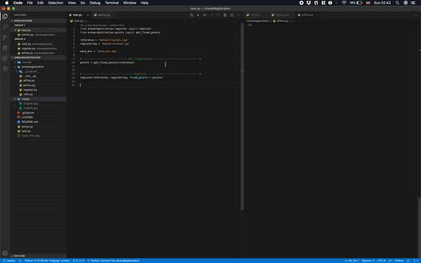

# Imgreg2D
Python code to perform 2D image registration and alignment. 





Simple napari based application to register a 2D image to a template. 


**The steps**
- 1 Defining a set of 3 points on the `reference` image (`fixed_points`) [<-- user input]
- 2 Defining the corresponding set of points on the `registering` image (`registering_points`) [<-- user input]
- 3 Computing an affine transform matrix 
- 4 Using the transform matrix to register the `registering` image to the `reference` image
- 5 Interactively regining the registration [<-- user input]


# Installation
Unitl the code is available on pipy:
```
pip install git+https://github.com/BrancoLab/imgreg2D.git --upgrade
```


# Usage
Steps 1 and 2 are necessary to compute an affine transform matrix which is used for the image registration. If you alrady have such a matrix (e.g. as a result of a previously run analysis), you can skip these steps. You can then just register the image and refine the affine. To do so pass....
## Step 1 - fixed points
## Step 2 - registering points
## Step 3 - refine the affine


# Credit and contribution
The original code was part of [Common-Coordinates-Behaviour](https://github.com/BrancoLab/Common-Coordinate-Behaviour) (credit: Philip Shamas). I (Federico Claudi) adapted Philip's code to work with napari.

Contributions are welcome! Just send a PR or open an issue as neeeded. 


